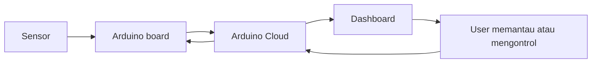
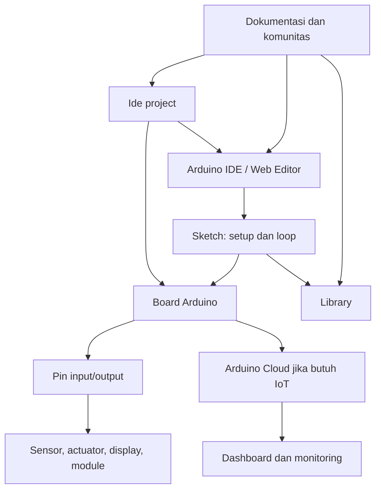

## Arduino Bukan Cuma Board Biru

Saat orang bilang "Arduino", maksudnya bisa beberapa hal sekaligus. Bisa board fisik seperti **Arduino Uno**, bisa software untuk menulis code, bisa bahasa pemrograman berbasis C/C++, bisa platform pembelajaran elektronik, atau bisa juga ekosistem library dan module yang bikin project jadi lebih cepat dibuat.

Cara paling gampang memahaminya: Arduino adalah jembatan antara dunia software dan dunia fisik. Lewat Arduino, code yang kamu tulis bisa menyalakan LED, membaca suhu, menggerakkan motor, membuka relay, atau mengirim data sensor ke internet.

Jadi Arduino bukan sekadar "alat untuk anak elektro". Arduino adalah entry point yang ramah untuk siapa pun yang ingin membuat benda fisik jadi bisa merespons input, menjalankan logic, dan menghasilkan output.

:::info[Intinya]
Arduino adalah gabungan antara hardware, software, dan community. Board-nya menjalankan code, IDE-nya dipakai untuk menulis dan upload code, library-nya mempercepat integrasi sensor, dan ekosistemnya membantu kamu naik dari project kecil ke prototype yang lebih serius.
:::

## Board Arduino: Otak Kecil untuk Project Elektronik

**Board Arduino** adalah papan elektronik yang berisi microcontroller, pin input/output, regulator power, port komunikasi, dan komponen pendukung lain. Microcontroller di dalam board inilah yang menjalankan program kamu.

Kalau komputer biasa punya CPU, RAM, storage, monitor, keyboard, dan sistem operasi besar, board Arduino jauh lebih sederhana. Ia tidak dibuat untuk membuka browser atau menjalankan aplikasi berat. Ia dibuat untuk satu hal yang jelas: membaca input, memproses logic, lalu mengontrol output secara stabil.

Contoh input:

- Tombol ditekan.
- Sensor suhu membaca perubahan temperatur.
- Sensor cahaya mendeteksi ruangan gelap.
- Potentiometer diputar.
- Data masuk dari module komunikasi.

Contoh output:

- LED menyala.
- Buzzer berbunyi.
- Servo bergerak.
- Relay menyalakan lampu.
- Data dikirim ke dashboard IoT.

Dalam project kecil, board Arduino sering jadi "otak" yang mengatur alur kerja. Misalnya: kalau sensor cahaya membaca ruangan gelap, nyalakan LED. Kalau suhu terlalu tinggi, hidupkan kipas. Kalau tombol ditekan, ubah mode alat.

## Arduino Uno, Nano, Mega, dan Keluarga Board Lain

Board Arduino punya banyak varian karena kebutuhan project juga beda-beda. Ada yang cocok untuk belajar dasar, ada yang kecil untuk prototype ringkas, ada yang punya banyak pin, dan ada yang sudah punya Wi-Fi atau Bluetooth.

| Board | Cocok Untuk | Gambaran Singkat |
|---|---|---|
| Arduino Uno | Belajar dasar dan project pemula | Board klasik, dokumentasi banyak, pin mudah dipahami |
| Arduino Nano | Project kecil di breadboard | Fungsi mirip Uno, ukuran lebih kecil |
| Arduino Mega | Project dengan banyak input/output | Punya pin lebih banyak untuk sensor, tombol, motor, atau display |
| Arduino Leonardo | Project yang butuh emulasi keyboard/mouse | Bisa dikenali komputer sebagai perangkat input |
| Arduino MKR / Nano IoT series | Project IoT | Beberapa varian punya konektivitas seperti Wi-Fi atau Bluetooth |
| Arduino Portenta | Prototype industri atau edge AI tertentu | Lebih powerful, cocok untuk kebutuhan advanced |

Untuk pemula, Arduino Uno sering jadi pilihan paling nyaman karena banyak tutorial memakai board ini. Tapi kalau kamu ingin memasang board langsung ke breadboard, Arduino Nano bisa lebih praktis. Kalau project kamu butuh banyak pin, Mega lebih lega.

Tidak ada board "paling benar" untuk semua project. Yang ada adalah board yang paling pas dengan kebutuhan power, ukuran, jumlah pin, konektivitas, dan budget.

## Pin Arduino: Tempat Board Berbicara dengan Dunia Luar

Pin adalah titik koneksi tempat Arduino menerima input atau mengirim output. Inilah bagian yang membuat code bisa berinteraksi dengan komponen fisik.

Secara umum, kamu akan sering bertemu beberapa jenis pin:

- **Digital pin**: membaca atau mengirim nilai sederhana seperti `HIGH` dan `LOW`.
- **Analog input pin**: membaca nilai bertingkat dari sensor analog, misalnya cahaya atau putaran potentiometer.
- **PWM pin**: membuat output digital terasa seperti analog, misalnya untuk mengatur terang LED atau kecepatan motor kecil.
- **Power pin**: menyediakan tegangan seperti 5V, 3.3V, dan GND.
- **Communication pin**: dipakai untuk protokol seperti UART, I2C, atau SPI.

Bayangkan pin seperti colokan komunikasi. Sensor mengirim informasi lewat pin input, lalu Arduino mengambil keputusan dari code. Setelah itu Arduino memberi perintah lewat pin output.

:::warning[Hati-hati Tegangan]
Tidak semua board Arduino memakai level tegangan yang sama. Ada board 5V dan ada board 3.3V. Sebelum menyambungkan sensor atau module, cek spesifikasi board dan module agar tidak merusak komponen.
:::

## Arduino IDE: Tempat Menulis dan Upload Code

**Arduino IDE** adalah code editor resmi untuk menulis, compile, dan upload program ke board Arduino. Di Arduino IDE 2, kamu bisa memilih board, memilih port, install board package, install library, membuka Serial Monitor, dan melihat error saat compile.

File program Arduino biasanya disebut **sketch**. Sketch inilah yang berisi instruksi untuk board. Saat kamu menekan tombol upload, IDE akan compile sketch, lalu mengirim hasilnya ke microcontroller di board.

Alur dasarnya seperti ini:


Di luar Arduino IDE desktop, Arduino juga punya opsi lain seperti **Arduino Web Editor** dan **Arduino Cloud**. Jadi kamu bisa memilih workflow yang paling cocok: lokal di laptop, berbasis browser, atau terhubung ke dashboard IoT.

## Sketch Arduino: Code yang Hidup di Board

Sketch Arduino biasanya punya dua fungsi utama: `setup()` dan `loop()`.

`setup()` berjalan sekali saat board dinyalakan atau di-reset. Bagian ini cocok untuk mengatur mode pin, memulai komunikasi serial, atau menyiapkan sensor.

`loop()` berjalan berulang-ulang selama board menyala. Bagian ini cocok untuk membaca sensor, mengecek kondisi, mengambil keputusan, dan mengontrol output.

Contoh struktur paling dasar:

```cpp
void setup() {
  pinMode(13, OUTPUT);
}

void loop() {
  digitalWrite(13, HIGH);
  delay(1000);
  digitalWrite(13, LOW);
  delay(1000);
}
```

Code di atas membuat pin 13 menyala selama satu detik, lalu mati selama satu detik, berulang terus. Ini mirip detak jantung project Arduino: sederhana, tapi dari pola ini kamu bisa mulai memahami input, output, timing, dan state.

:::info[Kenapa setup dan loop penting?]
Arduino dirancang untuk perangkat yang terus berjalan. Karena itu, pola `setup()` lalu `loop()` membuat kita berpikir seperti alat fisik: nyalakan, siapkan, lalu pantau kondisi terus-menerus.
:::

## Library: Jalan Pintas yang Bikin Sensor Lebih Mudah Dipakai

**Library** adalah kumpulan code siap pakai untuk membantu kita memakai komponen atau fitur tertentu. Tanpa library, kamu mungkin harus menulis detail komunikasi sensor dari nol. Dengan library, kamu bisa fokus ke logic project.

Misalnya, untuk membaca sensor suhu tertentu, library biasanya sudah menyediakan fungsi seperti:

```cpp
float suhu = sensor.readTemperature();
```

Di balik satu baris itu, library bisa saja menangani komunikasi I2C, membaca register sensor, mengubah data mentah, dan mengembalikan nilai dalam satuan yang lebih mudah dipahami.

Arduino IDE punya **Library Manager** untuk mencari dan install library. Banyak module elektronik juga menyertakan nama library yang direkomendasikan di dokumentasinya.

Tapi tetap hati-hati: library yang berbeda bisa punya cara pakai, kompatibilitas board, dan dependensi yang berbeda. Saat project error, cek tiga hal dulu: nama library benar, contoh code sesuai versi library, dan board yang kamu pakai memang didukung.

## Shield, Module, dan Sensor: Ekosistem yang Bisa Disusun

Salah satu alasan Arduino populer adalah ekosistem komponennya sangat luas. Kamu bisa menemukan sensor, motor driver, display, module komunikasi, dan shield yang dibuat untuk cepat dipakai bersama Arduino.

**Shield** adalah papan tambahan yang biasanya ditumpuk di atas board Arduino tertentu, terutama Uno. Shield bisa menambahkan fungsi seperti motor driver, Ethernet, prototyping area, atau display.

**Module** biasanya lebih fleksibel. Bentuknya bisa sensor suhu, sensor jarak, module relay, OLED display, GPS, RFID, atau wireless module. Module dihubungkan ke Arduino lewat jumper wire dan pin komunikasi.

| Komponen Ekosistem | Fungsi | Contoh |
|---|---|---|
| Sensor | Membaca kondisi dunia fisik | Suhu, cahaya, jarak, kelembapan |
| Actuator | Menghasilkan aksi fisik | Motor, servo, relay, solenoid |
| Display | Menampilkan informasi | LCD, OLED, seven-segment |
| Communication module | Mengirim data | Wi-Fi, Bluetooth, LoRa, GPS |
| Shield | Menambah fitur dengan bentuk plug-in | Motor shield, Ethernet shield |
| Breadboard dan jumper | Merakit prototype sementara | Uji rangkaian sebelum solder atau PCB |

Kalau board adalah otaknya, sensor adalah indera, actuator adalah tangan, dan software adalah pola pikirnya. Ekosistem Arduino menyatukan semua itu agar prototype bisa dibuat bertahap.

## Arduino Cloud: Saat Project Mulai Terhubung Internet

Untuk project yang butuh koneksi internet, Arduino punya **Arduino Cloud**. Dengan Cloud, kamu bisa membuat IoT project, menghubungkan device, membuat variable, dan memantau data lewat dashboard.

Contohnya, kamu bisa membuat alat pemantau suhu ruangan. Board membaca sensor, mengirim data ke Cloud, lalu dashboard menampilkan suhu secara visual. Kamu juga bisa membuat kontrol jarak jauh, misalnya tombol dashboard untuk menyalakan relay.

Konsep dasarnya seperti ini:



Cloud bukan kewajiban untuk belajar Arduino. Untuk project awal, board, IDE, dan komponen dasar sudah cukup. Tapi saat kamu ingin membuat project IoT, Cloud membantu menghubungkan hardware, data, dan dashboard dalam satu workflow.

## Bahasa Pemrograman Arduino: C/C++ yang Dibuat Lebih Ramah

Code Arduino pada dasarnya memakai C/C++ dengan struktur dan helper function yang dibuat lebih ramah untuk pemula. Kamu akan sering memakai fungsi seperti `pinMode()`, `digitalWrite()`, `digitalRead()`, `analogRead()`, `delay()`, dan `Serial.println()`.

Kamu tidak harus langsung menguasai C++ secara dalam untuk mulai. Untuk project awal, cukup pahami pola:

1. Tentukan pin.
2. Atur mode pin di `setup()`.
3. Baca input atau nyalakan output di `loop()`.
4. Gunakan `Serial Monitor` untuk melihat data dan debug.
5. Pecah logic jadi fungsi kecil saat code mulai panjang.

Lama-lama, kamu akan bertemu konsep yang lebih advanced seperti variable, function, array, class, timing tanpa `delay()`, interrupt, komunikasi serial, dan power management. Tapi semuanya bisa dipelajari bertahap dari project nyata.

## Open-Source dan Komunitas: Kenapa Arduino Cepat Berkembang

Arduino tumbuh besar karena sifatnya yang terbuka dan komunitasnya aktif. Banyak board, contoh project, library, tutorial, forum diskusi, dan dokumentasi dibuat agar orang bisa belajar dari pengalaman orang lain.

Open-source di Arduino berarti banyak aspek hardware dan software-nya bisa dipelajari, dimodifikasi, dan dikembangkan. Inilah yang membuat ekosistemnya luas: sekolah, maker, engineer, artist, designer, dan hobbyist bisa memakai fondasi yang sama untuk tujuan berbeda.

Kalau kamu stuck, besar kemungkinan orang lain pernah mengalami error yang mirip. Biasanya solusi bisa ditemukan dari dokumentasi resmi, contoh library, forum Arduino, GitHub issue, atau tutorial project.

:::success[Mindset yang Membantu]
Belajar Arduino bukan tentang menghafal semua pin dan library. Yang lebih penting adalah paham alur: baca dokumentasi, rakit sedikit, upload code, lihat hasil, debug, lalu ulangi.
:::

## Cara Memulai Belajar Arduino dari Nol

Kalau kamu baru mulai, jangan langsung mengejar project yang terlalu besar. Mulai dari rangkaian kecil yang bisa memberi feedback cepat.

Checklist awal yang realistis:

- [ ] Pilih board pemula, misalnya Arduino Uno atau Nano.
- [ ] Install Arduino IDE 2 dari website resmi Arduino.
- [ ] Sambungkan board ke laptop dan pilih board serta port yang benar.
- [ ] Upload contoh Blink.
- [ ] Buka Serial Monitor untuk belajar melihat output debug.
- [ ] Coba rangkaian LED eksternal di breadboard.
- [ ] Tambahkan satu input, misalnya push button atau potentiometer.
- [ ] Tambahkan satu sensor, misalnya sensor cahaya atau suhu.
- [ ] Rapikan project dengan library jika sudah memakai module tertentu.

Urutannya sengaja sederhana. Dengan cara ini, kamu membangun pemahaman dari hal paling dasar: board menerima power, IDE mengirim program, pin mengontrol komponen, dan code menentukan perilaku.

## Peta Besar Arduino dalam Satu Gambar Mental

Supaya semuanya terasa terhubung, bayangkan Arduino sebagai ekosistem yang punya beberapa lapisan.



Di sinilah Arduino terasa kuat. Kamu tidak belajar hardware sendirian, tidak juga software sendirian. Kamu belajar cara membuat code dan komponen fisik bekerja sebagai satu sistem.

## Langkah Selanjutnya

Sekarang kamu bisa melihat Arduino sebagai satu ekosistem utuh: board sebagai hardware, IDE sebagai tempat menulis dan upload sketch, library sebagai shortcut, komponen sebagai dunia luar, dan Cloud sebagai jembatan ke internet.

Langkah berikutnya paling aman adalah membuat project kecil yang jelas hasilnya. Upload Blink, pindahkan LED ke breadboard, lalu tambahkan push button. Dari situ, kamu sudah punya fondasi untuk masuk ke sensor, motor, display, dan prototype elektronik yang lebih menarik.

## Referensi

- [Arduino Docs: Getting Started with Arduino IDE 2](https://docs.arduino.cc/software/ide-v2/tutorials/getting-started-ide-v2/) - Dipakai untuk menjelaskan peran Arduino IDE, board selection, port, upload, dan workflow dasar.
- [Arduino Software](https://www.arduino.cc/en/software) - Dipakai untuk merujuk pilihan software resmi Arduino, termasuk Arduino IDE dan opsi editor lain.
- [Arduino Docs: Board Manager](https://docs.arduino.cc/software/ide-v2/tutorials/ide-v2-board-manager/) - Dipakai untuk menjelaskan konsep board package dan pengelolaan dukungan board di Arduino IDE.
- [Arduino Docs: Libraries](https://docs.arduino.cc/software/ide-v2/tutorials/ide-v2-installing-a-library/) - Dipakai untuk menjelaskan fungsi Library Manager dan peran library dalam project Arduino.
- [Arduino Docs: Blink](https://docs.arduino.cc/built-in-examples/basics/Blink/) - Dipakai sebagai contoh sketch awal dengan pola `setup()`, `loop()`, `pinMode()`, dan `digitalWrite()`.
- [Arduino Cloud Documentation](https://docs.arduino.cc/arduino-cloud/) - Dipakai untuk menjelaskan peran Arduino Cloud, device, variable, dan dashboard dalam project IoT.
