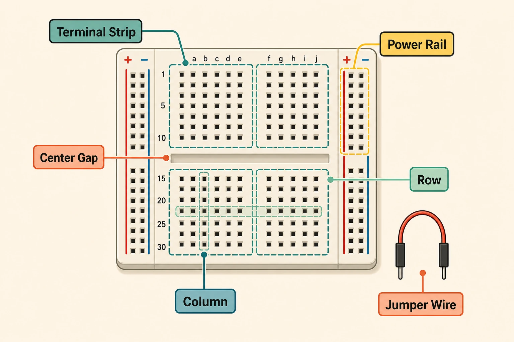
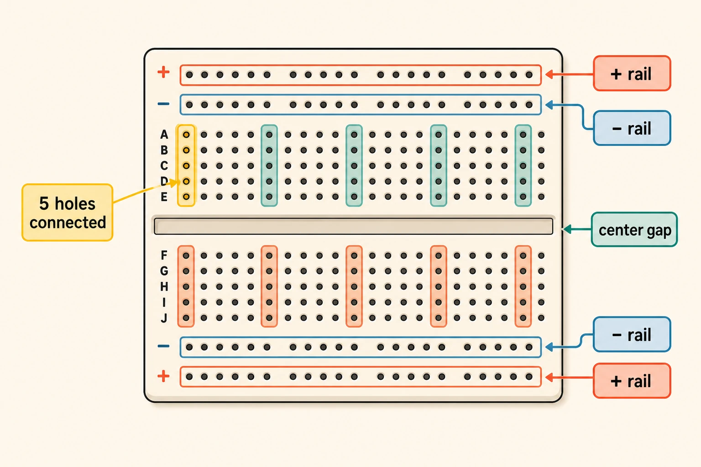
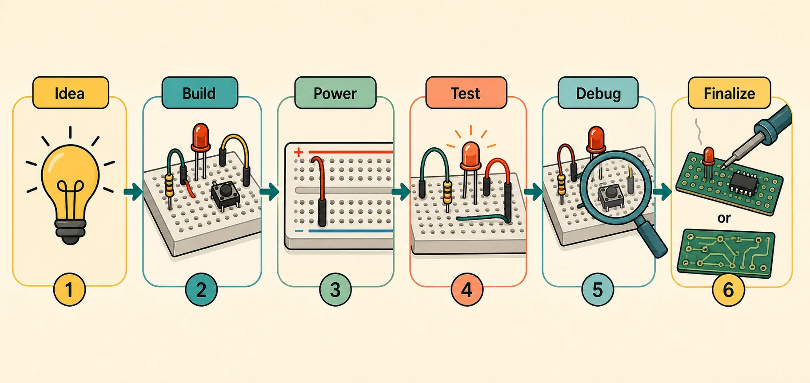
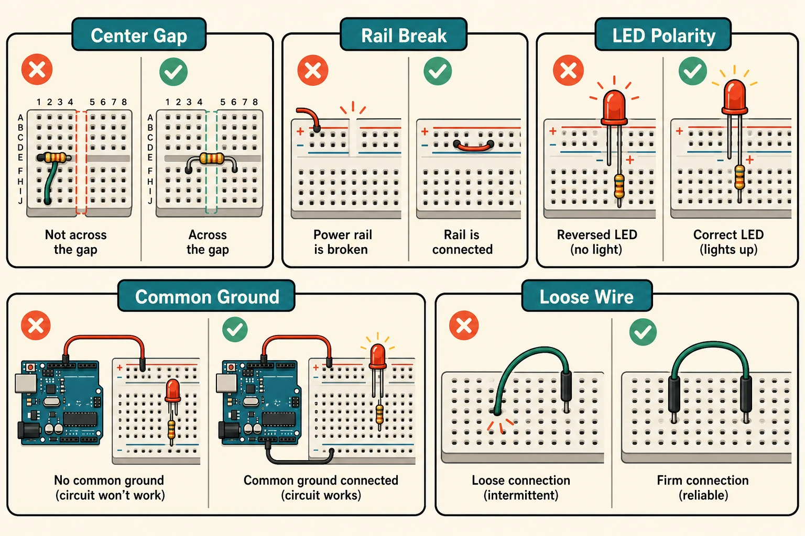

## Breadboard Itu Apa?

Breadboard adalah **papan untuk merangkai komponen elektronik tanpa solder**. Kamu cukup menancapkan kaki komponen atau jumper wire ke lubang-lubang kecil di permukaannya, lalu komponen itu akan terhubung lewat penjepit logam di bagian dalam breadboard.

Fungsi utamanya adalah membantu kita membuat rangkaian sementara. Kalau wiring salah, tinggal cabut dan pindahkan kabel. Kalau nilai resistor kurang cocok, tinggal ganti. Kalau ingin menambah sensor, kamu bisa menyisipkannya tanpa membuat PCB baru.

:::info[Inti Paling Penting]
Breadboard bukan sumber listrik dan bukan komponen pintar. Ia hanya papan koneksi sementara yang menghubungkan lubang-lubang tertentu di dalamnya, sehingga komponen bisa dirangkai tanpa solder.
:::

## Kenapa Breadboard Dipakai Saat Prototype?

Saat mengembangkan project elektronik, jarang sekali rangkaian pertama langsung benar. Biasanya kita perlu mencoba nilai resistor, posisi sensor, pin microcontroller, power supply, atau urutan logika program. Breadboard membuat proses itu lebih ringan.

Bayangkan kamu sedang membuat lampu otomatis dengan Arduino, LDR, resistor, dan LED. Jika langsung disolder, setiap kesalahan wiring akan memakan waktu untuk membongkar sambungan. Dengan breadboard, kamu bisa menguji satu bagian dulu: LED menyala atau tidak, sensor terbaca atau tidak, lalu baru menggabungkan semuanya.

Breadboard berguna karena:

- Tidak perlu solder untuk eksperimen awal.
- Komponen bisa dipakai ulang.
- Rangkaian mudah diubah saat debugging.
- Cocok untuk belajar hubungan input, proses, dan output.
- Membantu memvalidasi ide sebelum dibuat permanen.

Breadboard bukan pengganti PCB untuk produk final. Ia lebih cocok sebagai meja kerja sementara: cepat, fleksibel, dan nyaman untuk belajar.

## Bagaimana Cara Kerja Breadboard?

Kunci memahami breadboard ada pada **jalur internal**. Lubang-lubang di permukaan breadboard tidak berdiri sendiri. Di bawahnya ada klip logam yang menghubungkan beberapa lubang dalam satu grup.

Pada breadboard standar, area tengah biasanya dibagi menjadi dua sisi oleh celah tengah. Di setiap sisi, lima lubang dalam satu baris biasanya saling terhubung. Celah tengah dibuat agar IC DIP bisa dipasang di tengah tanpa kaki kiri dan kanan saling short.

Sementara itu, bagian pinggir biasanya disebut **power rail**. Jalur ini dipakai untuk distribusi tegangan seperti `5V`, `3.3V`, dan `GND`. Power rail sering diberi tanda merah untuk positif dan biru atau hitam untuk ground.

Secara sederhana:

| Area Breadboard | Pola Koneksi Umum | Fungsi |
|---|---|---|
| Terminal strip kiri | Lima lubang per baris terhubung | Area rangkaian utama |
| Terminal strip kanan | Lima lubang per baris terhubung | Area rangkaian utama |
| Center gap | Memisahkan sisi kiri dan kanan | Tempat IC DIP dipasang |
| Power rail | Lubang sepanjang rail terhubung searah garis | Distribusi power dan ground |

:::warning[Cek Breadboard yang Kamu Pakai]
Tidak semua breadboard punya power rail yang tersambung penuh dari ujung ke ujung. Beberapa breadboard memutus rail di bagian tengah, jadi kamu perlu jumper tambahan untuk menyambungkannya.
:::

## Bagian-Bagian Breadboard

Breadboard terlihat sederhana, tapi tiap bagiannya punya peran.

### Terminal Strip

Terminal strip adalah area utama tempat kamu menancapkan komponen. Biasanya terletak di tengah breadboard. Setiap baris berisi beberapa lubang yang terhubung secara internal.

Kalau satu kaki resistor masuk ke baris yang sama dengan jumper wire, keduanya akan tersambung. Tetapi jika dipasang di baris berbeda, keduanya tidak tersambung kecuali kamu menghubungkannya dengan kabel atau komponen lain.

### Center Gap

Center gap adalah celah panjang di tengah breadboard. Celah ini memisahkan dua sisi terminal strip. Komponen seperti IC DIP dipasang melintang melewati celah ini agar kaki kiri dan kanan berada di jalur berbeda.

Untuk pemula, celah ini juga membantu kita melihat breadboard sebagai dua area kerja: kiri dan kanan. Banyak kesalahan wiring terjadi karena mengira kedua sisi otomatis tersambung, padahal terpisah oleh center gap.

### Power Rail

Power rail adalah jalur panjang di sisi breadboard. Biasanya dipakai untuk membawa tegangan positif dan ground ke banyak titik rangkaian.

Contoh umum:

- Rail merah dihubungkan ke `5V` dari Arduino.
- Rail biru dihubungkan ke `GND` dari Arduino.
- Komponen mengambil power dari rail merah dan ground dari rail biru.

Power rail membantu rangkaian terlihat lebih rapi karena kamu tidak perlu menarik semua kabel langsung ke pin power board.

## Contoh Rangkaian Paling Dasar

Contoh pertama yang paling aman adalah LED dengan resistor. Tujuannya sederhana: memahami bahwa arus harus mengalir dari sumber tegangan, melewati komponen, lalu kembali ke ground.

Alur rangkaian LED dasar:

1. Hubungkan rail positif breadboard ke `5V`.
2. Hubungkan rail ground breadboard ke `GND`.
3. Pasang resistor dari rail positif ke salah satu baris terminal strip.
4. Pasang kaki panjang LED ke baris yang sama dengan resistor.
5. Pasang kaki pendek LED ke baris lain.
6. Hubungkan baris kaki pendek LED ke ground.

Jika LED tidak menyala, jangan panik. Cek polaritas LED, posisi resistor, dan apakah ground sudah tersambung.

:::success[Latihan Pertama yang Bagus]
Kalau kamu bisa membuat LED menyala di breadboard dan menjelaskan jalur arusnya, kamu sudah punya fondasi untuk memahami sensor, tombol, buzzer, dan module sederhana.
:::

## Cara Menggunakan Breadboard dengan Arduino

Breadboard sering dipakai bersama Arduino atau board microcontroller lain karena microcontroller punya banyak pin, sedangkan komponen butuh tempat untuk dirangkai.

Alur umum memakai breadboard dengan Arduino:

1. Sambungkan `GND` Arduino ke rail ground breadboard.
2. Sambungkan `5V` atau `3.3V` Arduino ke rail positif breadboard sesuai kebutuhan komponen.
3. Pasang komponen di terminal strip.
4. Hubungkan pin input/output Arduino ke baris komponen yang sesuai.
5. Upload program kecil untuk menguji satu fungsi.
6. Gunakan Serial Monitor jika perlu membaca nilai sensor.

Hal penting: **ground harus sama**. Jika Arduino membaca sensor yang diberi daya dari sumber lain, ground Arduino dan ground sumber itu biasanya perlu disatukan agar sinyal punya referensi yang sama.

## Kenapa Tidak Langsung Disolder?

Solder membuat koneksi lebih kuat, tetapi juga lebih permanen. Untuk rangkaian yang belum pasti, permanen justru merepotkan.

Breadboard cocok untuk fase:

- Mencoba konsep.
- Menguji sensor dan output.
- Membandingkan nilai komponen.
- Mencari pin yang paling nyaman.
- Debugging sebelum rangkaian dirapikan.

Solder atau PCB lebih cocok ketika:

- Rangkaian sudah stabil.
- Alat akan sering dipindahkan.
- Koneksi harus tahan getaran.
- Bentuk fisik sudah jelas.
- Project ingin dibuat lebih rapi dan tahan lama.

| Tahap Project | Media yang Cocok | Alasannya |
|---|---|---|
| Belajar konsep | Breadboard | Mudah dicoba dan dibongkar |
| Prototype awal | Breadboard | Cepat untuk iterasi |
| Prototype rapi | Perfboard atau soldered prototype | Lebih kuat daripada breadboard |
| Produk final | PCB | Rapi, stabil, dan bisa direplikasi |

## Kesalahan Umum Saat Memakai Breadboard

Breadboard sangat membantu, tapi ada beberapa jebakan klasik untuk pemula.

| Masalah | Penyebab Umum | Cara Mengecek |
|---|---|---|
| Komponen tidak bekerja | Kaki komponen tidak berada di jalur yang sama | Ikuti baris koneksi internal |
| Power tidak sampai | Power rail belum disambungkan | Ukur rail dengan multimeter |
| LED tidak menyala | Polaritas LED terbalik | Cek kaki panjang dan pendek LED |
| IC panas | Kaki salah posisi atau short | Matikan power dan cek center gap |
| Sensor terbaca aneh | Ground tidak tersambung | Pastikan semua ground punya referensi sama |
| Rangkaian kadang putus | Kabel jumper longgar | Ganti kabel atau pindah lubang |

:::warning[Matikan Power Saat Mengubah Wiring]
Biasakan mencabut power sebelum memindahkan kabel atau komponen. Kebiasaan kecil ini membantu mencegah short circuit dan komponen rusak.
:::

## Batasan Breadboard

Breadboard bukan alat ajaib untuk semua rangkaian. Ada batasan yang perlu kamu tahu supaya tidak memakainya di tempat yang kurang tepat.

Breadboard kurang cocok untuk:

- Arus besar seperti motor besar, pemanas, atau beban daya tinggi.
- Sinyal frekuensi tinggi yang sensitif terhadap noise.
- Rangkaian yang harus tahan getaran.
- Project final yang akan dipakai jangka panjang.
- Komponen dengan kaki terlalu besar atau bentuk mekanis tidak cocok.

Untuk belajar Arduino, sensor sederhana, LED, tombol, potentiometer, buzzer, relay module kecil, dan percobaan logika dasar, breadboard sangat berguna. Tetapi untuk power besar, gunakan driver, terminal block, solder, atau PCB yang lebih sesuai.

## Tips Memakai Breadboard Lebih Rapi

Rangkaian yang rapi lebih mudah di-debug. Ini bukan soal estetika saja, tapi soal mengurangi kebingungan saat ada masalah.

Tips praktis:

- Gunakan warna kabel konsisten: merah untuk power, hitam atau biru untuk ground.
- Buat kabel sependek mungkin, tapi jangan terlalu tegang.
- Pisahkan area input dan output jika rangkaian mulai ramai.
- Pasang komponen satu per satu, lalu uji setelah setiap perubahan.
- Foto rangkaian sebelum membongkar agar bisa diulang.
- Pakai multimeter untuk memastikan jalur benar-benar tersambung.

Kalau rangkaian mulai sulit dibaca, itu tanda bagus untuk mulai menggambar skematik sederhana. Skematik membantu kamu memikirkan hubungan antar komponen, sementara breadboard membantu membuktikannya secara fisik.

## Kesimpulan

Breadboard adalah alat dasar yang sangat penting untuk belajar dan mengembangkan prototype elektronik. Ia membuat proses eksperimen lebih cepat karena komponen bisa dipasang tanpa solder, wiring bisa diubah kapan saja, dan kesalahan bisa diperbaiki tanpa merusak rangkaian.

Yang perlu kamu pahami bukan hanya bentuknya, tetapi pola koneksi internalnya: terminal strip, center gap, dan power rail. Setelah itu jelas, breadboard berubah dari “papan penuh lubang” menjadi alat kerja yang sangat masuk akal untuk membuat project pertama.

## Referensi

- [SparkFun - How to Use a Breadboard](https://learn.sparkfun.com/tutorials/how-to-use-a-breadboard/all) - dipakai untuk menjelaskan bagian breadboard, pola koneksi internal, terminal strip, dan power rail.
- [Science Buddies - How to Use a Breadboard](https://www.sciencebuddies.org/science-fair-projects/references/how-to-use-a-breadboard) - dipakai untuk penjelasan pemula tentang cara kerja breadboard dan contoh penggunaan rangkaian dasar.
- [Adafruit Learning System - Breadboards for Beginners](https://learn.adafruit.com/breadboards-for-beginners) - dipakai sebagai referensi tambahan untuk praktik breadboard bagi pemula.
