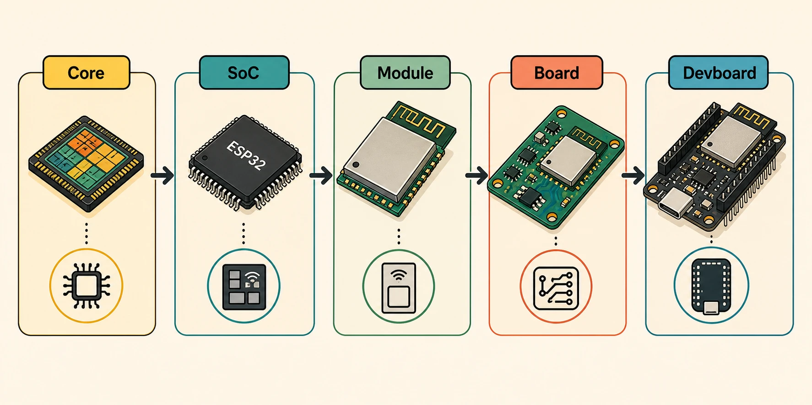
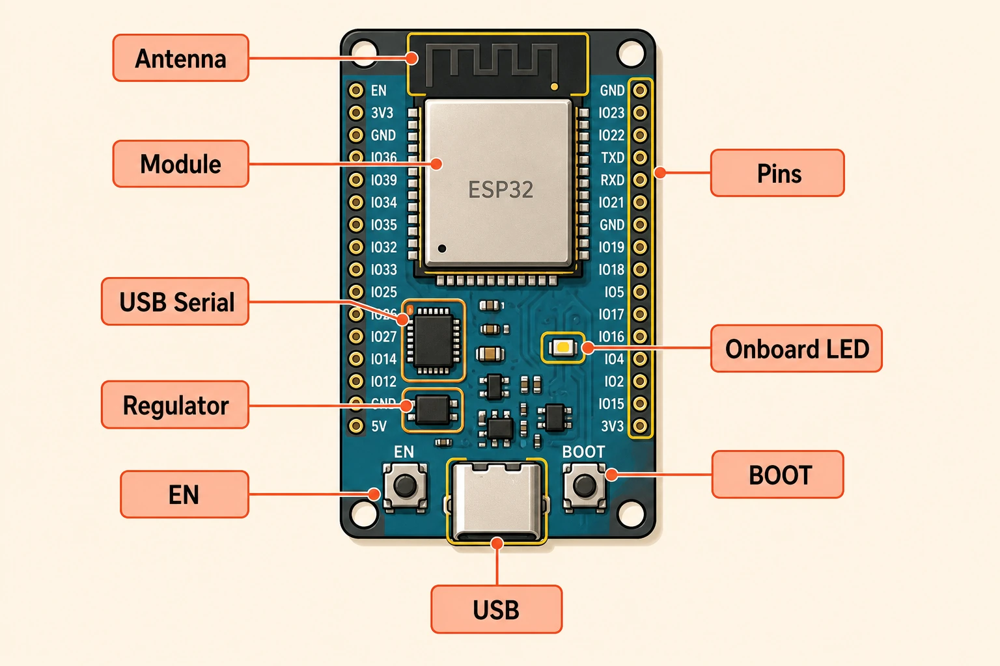
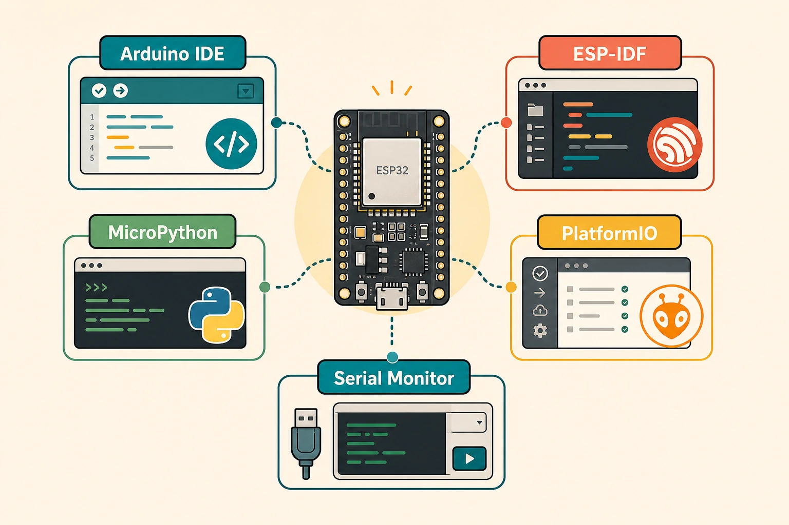
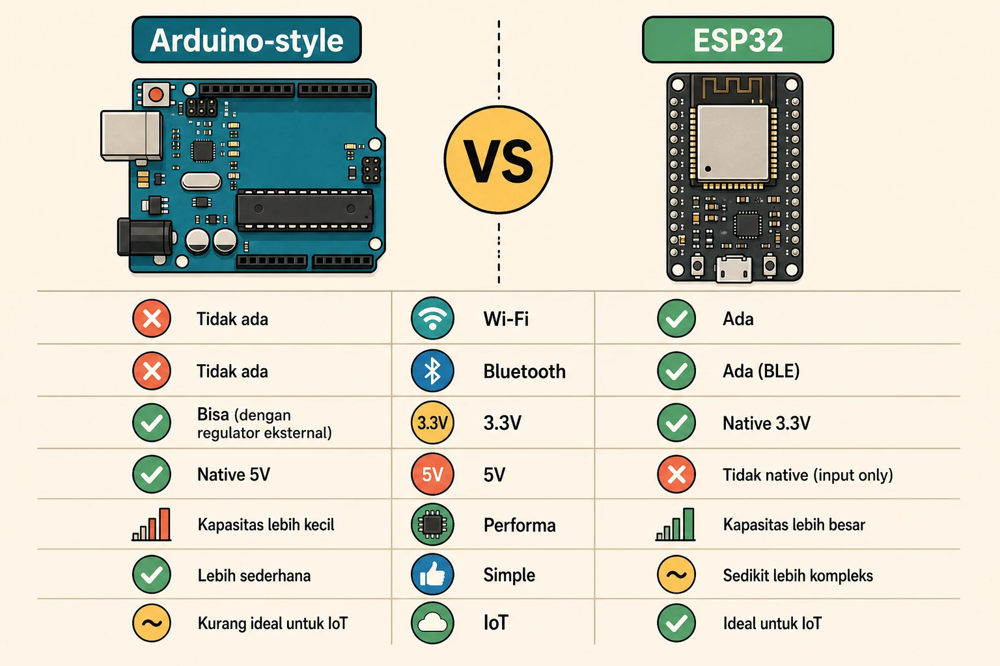

## ESP32 Itu Apa?

ESP32 adalah keluarga **System-on-Chip** dari Espressif yang menggabungkan microcontroller, konektivitas wireless, dan banyak peripheral dalam satu chip. Versi ESP32 klasik dikenal karena punya Wi-Fi, Bluetooth, processor Xtensa dual-core, SRAM internal, GPIO, ADC, DAC, SPI, I2C, UART, PWM, dan fitur low-power.

Kalau Arduino Uno sering dipakai sebagai pintu masuk belajar microcontroller, ESP32 sering dipilih ketika project mulai butuh koneksi internet, komunikasi Bluetooth, performa lebih tinggi, atau jumlah fitur yang lebih kaya.

:::info[Inti Paling Penting]
ESP32 bukan hanya satu board. ESP32 bisa berarti chip SoC, module berisi chip dan flash, atau devboard siap pakai yang sudah punya USB, regulator, tombol, dan pin header.
:::

## Dari Core sampai Devboard

Supaya tidak bingung, bayangkan ESP32 sebagai beberapa lapisan yang naik dari level paling kecil sampai bentuk yang biasa kamu pegang.

| Lapisan | Bentuk | Fungsi |
|---|---|---|
| Core processor | Bagian di dalam chip | Menjalankan instruksi program |
| SoC ESP32 | Chip utama | Menggabungkan processor, Wi-Fi, Bluetooth, memory, dan peripheral |
| Module ESP32 | Papan kecil berpelindung logam | Berisi SoC, flash, crystal, antena, dan komponen RF |
| Board custom | PCB buatan sendiri | Menggunakan module ESP32 untuk produk atau prototype khusus |
| Devboard | Board siap pakai | Menambahkan USB, regulator, tombol, header pin, dan rangkaian auto-upload |

Kalau kamu membeli “ESP32 DevKit”, biasanya yang kamu dapat adalah **devboard**. Di atas devboard itu ada module ESP32. Di dalam module ada chip ESP32. Di dalam chip ada core processor dan peripheral.

Lapisan ini penting karena kebutuhan pemula dan kebutuhan produk berbeda. Pemula biasanya mulai dari devboard karena tinggal colok USB. Produk final sering memakai module karena lebih ringkas dan lebih mudah disertifikasi dibanding merancang radio dari nol.

## Core, SoC, dan Peripheral

Pada ESP32 klasik, chip ini memakai processor Xtensa 32-bit LX6. Banyak varian ESP32 memiliki dua core, sehingga ESP32 bisa menjalankan beberapa pekerjaan lebih fleksibel dibanding microcontroller sederhana.

Tetapi kekuatan ESP32 bukan hanya di core processor. Sebagai SoC, ESP32 juga punya banyak peripheral yang bisa dipakai untuk berinteraksi dengan dunia luar.

Beberapa fitur umum ESP32:

- Wi-Fi 2.4 GHz untuk koneksi jaringan.
- Bluetooth Classic dan Bluetooth Low Energy pada ESP32 klasik.
- GPIO untuk input-output digital.
- ADC untuk membaca sensor analog.
- PWM untuk mengatur LED, motor driver, atau servo tertentu.
- SPI dan I2C untuk sensor, display, dan module.
- UART untuk komunikasi serial.
- Touch sensor pada beberapa pin.
- Deep sleep untuk project hemat daya.

Perlu dicatat: keluarga ESP32 punya banyak varian seperti ESP32, ESP32-S2, ESP32-S3, ESP32-C3, ESP32-C6, dan lainnya. Tidak semua varian punya fitur yang sama. Ada yang fokus ke USB native, AI/vector instructions, RISC-V, Wi-Fi 6, Zigbee/Thread, atau low-power.

:::warning[Cek Varian Board]
Jangan menganggap semua board bernama ESP32 punya fitur identik. Selalu cek datasheet atau halaman board karena jumlah pin, Bluetooth, USB, flash, PSRAM, dan fitur wireless bisa berbeda.
:::

## Module ESP32: Kenapa Ada Pelindung Logam?

Module ESP32 adalah bentuk yang sering terlihat seperti kotak kecil dengan pelindung logam di atasnya. Contoh umum adalah ESP32-WROOM atau ESP32-WROVER.

Di dalam module biasanya ada:

- Chip ESP32.
- Flash memory eksternal.
- Crystal oscillator.
- Antena PCB atau konektor antena eksternal.
- Komponen RF pendukung.
- Shield logam untuk membantu stabilitas dan kepatuhan radio.

Module membantu developer karena bagian radio dan antena sudah dirancang oleh produsen. Untuk prototype dan produk, ini jauh lebih praktis daripada membeli chip ESP32 polos lalu mendesain rangkaian RF sendiri.

## Devboard ESP32: Bentuk yang Paling Ramah Pemula

Devboard ESP32 adalah board siap pakai yang membuat module ESP32 mudah diprogram dan mudah disambungkan ke breadboard atau jumper wire. Contoh populer adalah ESP32-DevKitC dan banyak board kompatibel lain.

Pada devboard ESP32, biasanya kamu menemukan:

| Bagian | Fungsi |
|---|---|
| Module ESP32 | Bagian utama yang menjalankan program dan wireless |
| USB-to-serial | Menghubungkan laptop ke ESP32 untuk upload dan serial monitor |
| Voltage regulator | Menurunkan tegangan USB menjadi tegangan kerja board |
| Tombol EN/Reset | Menjalankan ulang board |
| Tombol BOOT | Membantu masuk mode flashing/upload |
| Header pin | Mengakses GPIO, power, ground, dan peripheral |
| LED onboard | Indikator sederhana untuk testing |

Devboard membuat proses belajar jauh lebih mudah. Kamu tidak perlu langsung memikirkan regulator, USB-to-serial, tombol boot, dan layout power. Semua sudah disiapkan agar kamu bisa fokus ke wiring dan code.

## Cara Kita Berinteraksi dengan ESP32

Ada dua cara utama berinteraksi dengan ESP32: **hardware** dan **software**.

Di sisi hardware, kita menghubungkan ESP32 ke sensor, aktuator, display, breadboard, power supply, dan module lain lewat pin. Pin-pin ini bisa dipakai sebagai input, output, komunikasi serial, SPI, I2C, PWM, ADC, dan fungsi khusus lain.

Di sisi software, kita menulis program lalu menguploadnya ke ESP32. Setelah program berjalan, kita bisa melihat log lewat Serial Monitor, mengirim data lewat Wi-Fi, menerima perintah dari smartphone, atau membaca sensor secara berkala.

Workflow pemula biasanya seperti ini:

1. Colok devboard ESP32 ke laptop lewat USB.
2. Install driver USB-to-serial jika dibutuhkan.
3. Pilih toolchain: Arduino IDE, PlatformIO, MicroPython, atau ESP-IDF.
4. Pilih board dan port.
5. Tulis program sederhana.
6. Upload ke board.
7. Pantau output lewat Serial Monitor.
8. Hubungkan sensor atau aktuator di breadboard.
9. Uji, debug, dan ulangi.

## Arduino IDE, ESP-IDF, MicroPython, dan PlatformIO

ESP32 tidak dikunci ke satu cara programming. Inilah salah satu kekuatannya, tapi juga alasan pemula kadang bingung.

| Cara Programming | Cocok Untuk | Catatan |
|---|---|---|
| Arduino IDE + Arduino core for ESP32 | Pemula yang sudah familiar dengan Arduino | API sederhana, banyak library, cepat mulai |
| ESP-IDF | Project serius dan kontrol fitur penuh | Official framework dari Espressif, lebih teknis |
| MicroPython | Belajar cepat dan scripting | Interaktif, enak untuk eksperimen, tidak selalu secepat C/C++ |
| PlatformIO | Workflow modern di VS Code | Enak untuk project terstruktur dan dependency |

Kalau kamu baru mulai, Arduino IDE sering menjadi jalur paling ramah. Kalau kamu ingin memahami ESP32 lebih dalam, ESP-IDF adalah jalur resmi yang memberi kontrol lebih luas terhadap FreeRTOS, networking, partition table, component, dan fitur chip.

## ESP32 vs Arduino Uno

Perbandingan ESP32 dengan Arduino Uno perlu hati-hati karena keduanya sering dipakai untuk tujuan yang berbeda. Arduino Uno adalah board belajar microcontroller yang sederhana dan stabil. ESP32 adalah SoC modern dengan wireless dan fitur lebih padat.

| Aspek | Arduino Uno | ESP32 |
|---|---|---|
| Fokus utama | Belajar dasar microcontroller | IoT, wireless, prototype kompleks |
| Konektivitas | Tidak ada Wi-Fi/Bluetooth bawaan | Wi-Fi dan Bluetooth pada banyak varian |
| Tegangan logika | Umumnya 5V | Umumnya 3.3V |
| Performa | Lebih sederhana | Lebih tinggi |
| Jumlah fitur | Lebih sedikit, mudah dipahami | Lebih banyak, perlu cek datasheet |
| Kemudahan pemula | Sangat ramah untuk dasar | Ramah, tapi lebih banyak detail |
| Ekosistem | Sangat besar untuk belajar | Sangat besar untuk IoT dan embedded modern |

ESP32 bukan “pengganti mutlak” Arduino Uno. Kalau tujuanmu belajar konsep pin digital, LED, tombol, dan dasar elektronika, Uno masih sangat nyaman. Kalau tujuanmu membuat alat yang terhubung Wi-Fi, membaca sensor, mengirim data ke server, atau berkomunikasi dengan smartphone, ESP32 biasanya lebih praktis.

## Kelebihan ESP32

ESP32 populer karena memberi banyak fitur dalam harga dan ukuran yang relatif terjangkau.

Kelebihan utama ESP32:

- Wi-Fi dan Bluetooth tersedia di banyak varian.
- Performa lebih tinggi dibanding banyak board pemula klasik.
- Banyak GPIO dan peripheral.
- Mendukung low-power mode untuk project baterai.
- Bisa diprogram dengan beberapa ekosistem.
- Komunitas besar dan banyak contoh project.
- Cocok untuk IoT, data logger wireless, smart home, sensor node, dan controller portable.

Untuk project IoT, nilai plus terbesar ESP32 adalah kamu tidak perlu menambahkan module Wi-Fi terpisah. Board sudah bisa terhubung ke jaringan, mengirim HTTP request, membuat web server kecil, memakai MQTT, atau terhubung ke platform cloud.

## Kekurangan dan Hal yang Perlu Diwaspadai

ESP32 kuat, tapi bukan berarti selalu paling mudah.

Hal yang perlu diperhatikan:

- Logika ESP32 umumnya 3.3V, jadi hati-hati dengan sensor atau module 5V.
- Pin tertentu punya fungsi bootstrapping, sehingga tidak bebas dipakai sembarangan.
- ADC ESP32 tidak selalu seideal ekspektasi pemula dan perlu kalibrasi untuk pengukuran serius.
- Wi-Fi bisa membuat konsumsi daya naik.
- Deep sleep butuh desain power yang benar agar benar-benar hemat baterai.
- Banyak board kompatibel punya kualitas regulator, USB chip, dan layout yang berbeda.
- Dokumentasi varian perlu dibaca karena fitur tiap seri ESP32 tidak sama.

:::warning[3.3V Itu Penting]
Jangan langsung menghubungkan sinyal 5V ke pin ESP32 tanpa memastikan pin itu toleran atau memakai level shifter. Banyak pin ESP32 bekerja pada logika 3.3V.
:::

## Kapan Sebaiknya Memilih ESP32?

Pilih ESP32 jika project kamu membutuhkan:

- Koneksi Wi-Fi.
- Bluetooth atau BLE.
- Sensor node yang mengirim data.
- Web server kecil di board.
- MQTT atau integrasi IoT.
- Banyak peripheral dalam satu board.
- Prototype yang nantinya bisa diperkecil menjadi module-based product.

Pilih board yang lebih sederhana seperti Arduino Uno jika kamu baru ingin memahami dasar elektronik tanpa distraksi Wi-Fi, konfigurasi board, dan detail pin yang lebih banyak.

Pilih microcontroller lain jika project kamu butuh kebutuhan khusus, misalnya ultra-low-power ekstrem, USB HID tertentu, timing real-time yang sangat ketat, atau ekosistem industri tertentu.

## Checklist Memulai ESP32

Untuk mulai belajar ESP32, kamu bisa menyiapkan:

- [ ] Devboard ESP32 yang dokumentasinya jelas.
- [ ] Kabel USB data.
- [ ] Breadboard dan jumper wire.
- [ ] LED dan resistor.
- [ ] Satu sensor sederhana, misalnya DHT, LDR, atau sensor jarak.
- [ ] Arduino IDE atau VS Code + PlatformIO.
- [ ] Driver USB-to-serial jika board tidak terdeteksi.
- [ ] Referensi pinout board yang kamu pakai.

Project pertama yang bagus:

- Blink LED.
- Baca tombol.
- Baca sensor analog.
- Tampilkan data di Serial Monitor.
- Hubungkan ESP32 ke Wi-Fi.
- Kirim data sensor ke endpoint sederhana atau MQTT broker.

## Kesimpulan

ESP32 adalah platform microcontroller modern yang kuat karena menggabungkan processor, wireless, peripheral, dan ekosistem software yang luas. Untuk memahaminya, kamu perlu melihat lapisannya: core di dalam chip, chip sebagai SoC, module sebagai bentuk siap-integrasi, dan devboard sebagai bentuk paling nyaman untuk belajar.

Dibanding Arduino Uno, ESP32 menawarkan konektivitas dan performa yang lebih besar, tetapi juga membawa detail tambahan seperti logika 3.3V, pilihan framework, variasi pin, dan konsumsi daya wireless. Kalau kamu ingin membuat prototype IoT atau alat elektronik yang terhubung jaringan, ESP32 adalah salah satu pilihan paling menarik untuk dipelajari.

## Referensi

- [Espressif - ESP32 SoC](https://www.espressif.com/en/products/socs/esp32) - dipakai untuk menjelaskan posisi ESP32 sebagai SoC dengan Wi-Fi, Bluetooth, dan fitur microcontroller.
- [ESP32 Datasheet](https://www.espressif.com/sites/default/files/documentation/esp32_datasheet_en.pdf) - dipakai untuk merujuk fitur core, wireless, peripheral, dan batasan teknis ESP32 klasik.
- [ESP-IDF Programming Guide - Get Started](https://docs.espressif.com/projects/esp-idf/en/latest/esp32/get-started/index.html) - dipakai untuk menjelaskan workflow resmi ESP-IDF dan proses berinteraksi dengan ESP32 lewat toolchain.
- [ESP32-DevKitC User Guide](https://docs.espressif.com/projects/esp-dev-kits/en/latest/esp32/esp32-devkitc/index.html) - dipakai untuk menjelaskan devboard, tombol, USB-to-serial, regulator, dan header pin.
- [Arduino Core for ESP32 Documentation](https://docs.espressif.com/projects/arduino-esp32/en/latest/) - dipakai untuk menjelaskan opsi programming ESP32 lewat Arduino IDE dan ekosistem Arduino.
